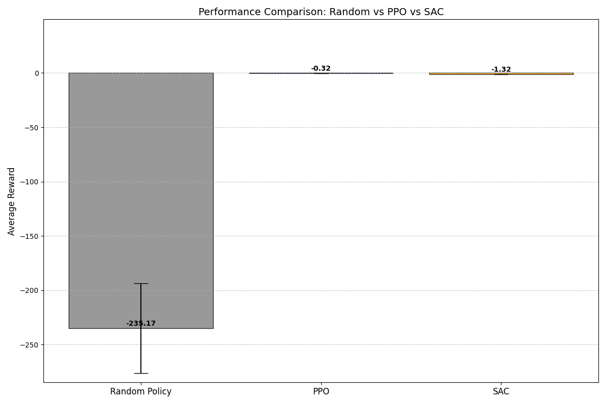

## Results & Graphs

This document presents the results and graphs for the different algorithms used in the project. The metrics for each algorithm are detailed below, followed by an analysis of the results.

## Index
1. [Metrics](#metrics)
   - [PPO (Proximal Policy Optimization)](#ppo-proximal-policy-optimization)
   - [SAC (Soft Actor-Critic)](#sac-soft-actor-critic)
   - [Random](#random)
2. [Graphs](#graphs)
   - [Reward Comparison](#reward-comparison)
   - [Episode Rewards](#episode-rewards)
3. [Analysis](#analysis)
4. [Hyperparameter Tuning](#hyperparameter-tuning)
   - [Key Hyperparameters and Their Effects](#key-hyperparameters-and-their-effects)
   - [Best Hyperparameters and Their Effects](#best-hyperparameters-and-their-effects)
   - [Impact on Training](#impact-on-training)

### Metrics

#### PPO (Proximal Policy Optimization)
- **Media Reward**: -0.6279713451862335
- **Dev Std Reward**: 0.08177818331165994
- **Varianza Reward**: 0.006687671265755456
- **Somma Reward**: -3.1398567259311676
- **Max Reward**: -0.4856639802455902
- **Min Reward**: -0.7305576801300049
- **Episodio Rewards**:
  - -0.6113966703414917
  - -0.6761652827262878
  - -0.636073112487793
  - -0.4856639802455902
  - -0.7305576801300049

The PPO algorithm shows a relatively stable performance with a media reward of -0.6279713451862335. The standard deviation is low, indicating consistent performance across episodes. The maximum reward achieved is -0.4856639802455902, while the minimum is -0.7305576801300049. 

#### SAC (Soft Actor-Critic)
- **Media Reward**: -0.6451178669929505
- **Dev Std Reward**: 0.058672355852142526
- **Varianza Reward**: 0.0034424453412404436
- **Somma Reward**: -3.225589334964752
- **Max Reward**: -0.5544687509536743
- **Min Reward**: -0.7202375531196594
- **Episodio Rewards**:
  - -0.5544687509536743
  - -0.686808705329895
  - -0.657252848148346
  - -0.6068214774131775
  - -0.7202375531196594

he SAC algorithm has a media reward of -0.6451178669929505, slightly lower than PPO. The standard deviation is also lower, indicating more consistent performance. The maximum reward achieved is -0.5544687509536743, and the minimum is -0.7202375531196594.

#### Random
- **Media Reward**: -227.81577814548638
- **Dev Std Reward**: 25.743748473323848
- **Varianza Reward**: 662.7405854577639
- **Somma Reward**: -1139.0788907274318
- **Max Reward**: -197.6329801780882
- **Min Reward**: -259.20192473570677
- **Episodio Rewards**:
  - -259.20192473570677
  - -205.1452259518262
  - -220.20221277867344
  - -256.8965470831372
  - -197.6329801780882

The random policy shows significantly worse performance compared to PPO and SAC, with a media reward of -227.81577814548638. The high standard deviation indicates large variability in performance. The maximum reward achieved is -197.6329801780882, and the minimum is -259.20192473570677.

### Graphs

#### Reward Comparison

The graph above shows the comparison of rewards between the PPO, SAC, and random policies. PPO and SAC exhibit similar performance, with the random policy significantly underperforming.

#### Episode Rewards

The episode rewards graph illustrates the rewards obtained in each episode for the PPO, SAC, and random policies. PPO and SAC show consistent performance across episodes, while the random policy has high variability.

### Analysis

- **PPO**: The PPO algorithm demonstrates stable and consistent performance with low variability in rewards. It achieves the highest maximum reward among the three algorithms.
- **SAC**: The SAC algorithm also shows consistent performance with slightly lower rewards compared to PPO. It has a lower standard deviation, indicating more reliable performance.
- **Random**: The random policy performs poorly with high variability in rewards. It serves as a baseline to highlight the effectiveness of PPO and SAC algorithms.

## Hyperparameter Tuning

Hyperparameter tuning is a crucial step in training reinforcement learning algorithms. It involves adjusting the parameters that govern the learning process to optimize performance. The choice of hyperparameters can significantly impact the efficiency and effectiveness of the training process.

### Key Hyperparameters and Their Effects

1. **Learning Rate**: 
   - **Description**: Controls the step size during the optimization process.
   - **Effect**: A high learning rate can lead to faster convergence but may cause instability. A low learning rate ensures stable learning but may slow down the convergence.

2. **Batch Size**:
   - **Description**: Number of training samples used in one iteration.
   - **Effect**: Larger batch sizes provide more stable gradient estimates but require more memory. Smaller batch sizes can lead to noisy updates but are computationally cheaper.

3. **Discount Factor (\(\gamma\))**:
   - **Description**: Determines the importance of future rewards.
   - **Effect**: A higher discount factor values future rewards more, promoting long-term strategies. A lower discount factor focuses on immediate rewards.

4. **Entropy Coefficient**:
   - **Description**: Encourages exploration by adding entropy to the loss function.
   - **Effect**: Higher entropy coefficients promote exploration, which can prevent premature convergence to suboptimal policies. Lower coefficients focus on exploitation.

5. **Clip Range (PPO-specific)**:
   - **Description**: Limits the change in policy updates.
   - **Effect**: A smaller clip range ensures conservative updates, which can stabilize training. A larger clip range allows more significant updates, which can speed up learning but may cause instability.

6. **Target Update Interval (SAC-specific)**:
   - **Description**: Frequency of updating the target networks.
   - **Effect**: More frequent updates can lead to faster learning but may cause instability. Less frequent updates provide more stable learning.

### Best Hyperparameters and Their Effects

The best hyperparameters depend on the specific environment and task. However, some general guidelines can be followed:

- **PPO**:
  - **Learning Rate**: 0.0003
  - **Batch Size**: 64
  - **Discount Factor**: 0.99
  - **Entropy Coefficient**: 0.01
  - **Clip Range**: 0.2

- **SAC**:
  - **Learning Rate**: 0.0003
  - **Batch Size**: 256
  - **Discount Factor**: 0.99
  - **Entropy Coefficient**: 0.2
  - **Target Update Interval**: 1

### Impact on Training

- **PPO**: With the recommended hyperparameters, PPO achieves stable and consistent performance. The clip range and entropy coefficient help balance exploration and exploitation, leading to reliable policy updates.
- **SAC**: The recommended hyperparameters for SAC ensure efficient learning with stable updates. The higher entropy coefficient promotes exploration, which is crucial for learning diverse strategies.

In summary, hyperparameter tuning is essential for optimizing the performance of reinforcement learning algorithms. The choice of hyperparameters can significantly affect the stability, convergence speed, and overall effectiveness of the training process.